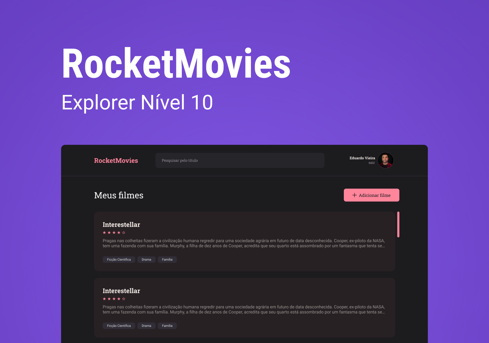

## Rocketmovies

### Description:

The Rocketmovies project consists of an application that allows users to create their notes of movies in a personalized way. To this end, the project has an API that stores the notes and allows the creation of the user account and the searching of the notes.

The back-end of the project (this repository) was developed in Node.js and Knex, allowing security and efficiency in the handling of application data.

### Preview:

<p align="center">
  
</p>

### Tech stack:
 
- [React JS](https://react.dev)
- [TypeScript](https://www.typescriptlang.org)
- [Tailwindcss](https://tailwindcss.com)
- [Node.js](https://nodejs.org/en)
- [Git/GitHub](https://git-scm.com)

### Usage:

You can clone this project and install the dependencies with the following command:

```sh
git clone https://github.com/EduVieira131/Rocketmovies.git
cd Rocketmovies
npm install
npm run dev
```